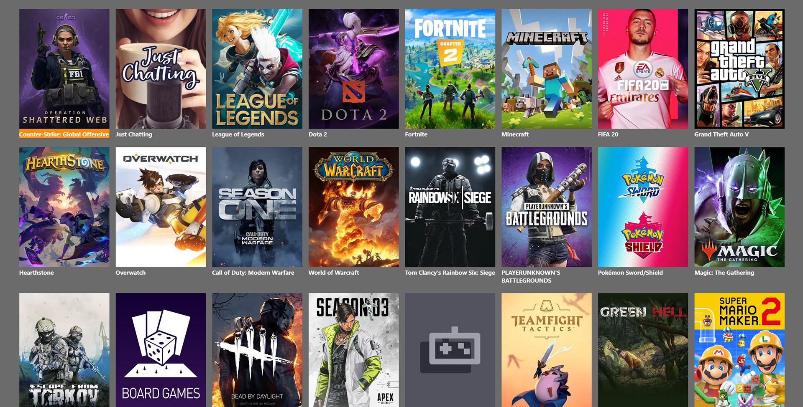

# Application for watching streams from Twitch directly on Samsung Tizen powered TV


Using react+redux. Required application registration at:
```
https://dev.twitch.tv/console
```
Then filling Client-ID in:
```
/src/actions/manageStreamsList.js
```
App needs to be build using:
```
yarn build
```
Then embedded into Tizen Studio project and built for using on TV.
