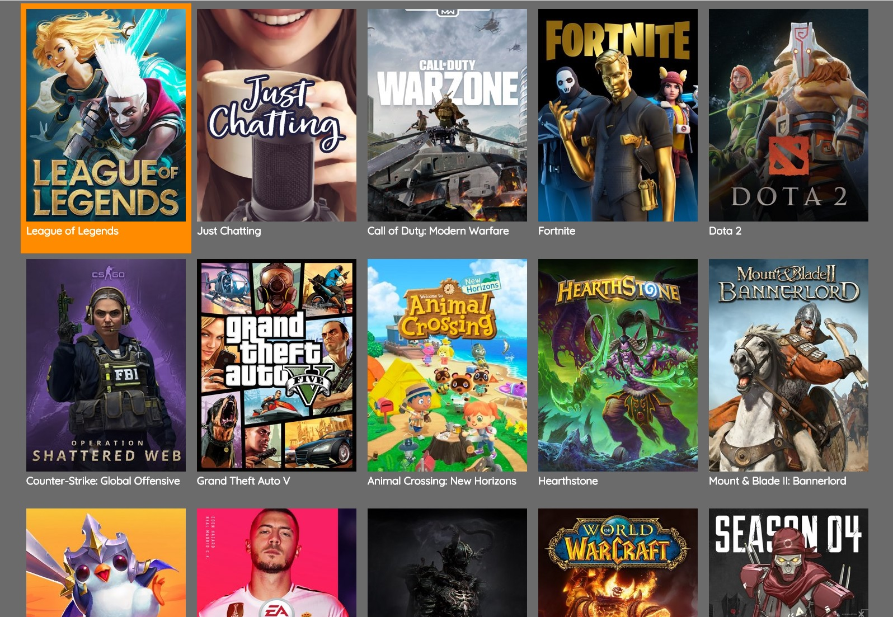
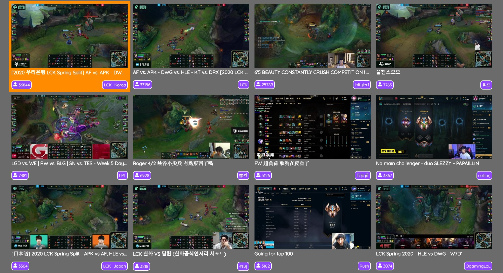

# Streams

## Application for watching streams from Twitch directly on Samsung Tizen powered TV



**Update**
Recently Twitch has blocked embedding player on non-https origins and since Tizen uses "file://" it's not possible to use it anymore as a standalone application. The webapp has now to be hosted on an external server and the application on Tizen is serving only as full screen creator and forwarder to external server.
[It's hosted here for the time being.](https://streams.cf)

Since Samsung is requiring from me a formal authorization to use content of Twitch (it's free to use) and I don't have one, they won't accept the app in Tizen Store. Therefore in order to use it on your Smart TV you have to build it on your own in Tizen Studio with super simple HTML, such as:
```
<!DOCTYPE html>
    <html>
        <head>
            <script>window.location.replace("https://streams.cf")</script>
        </head>
    <body>
    </body>
</html>
```